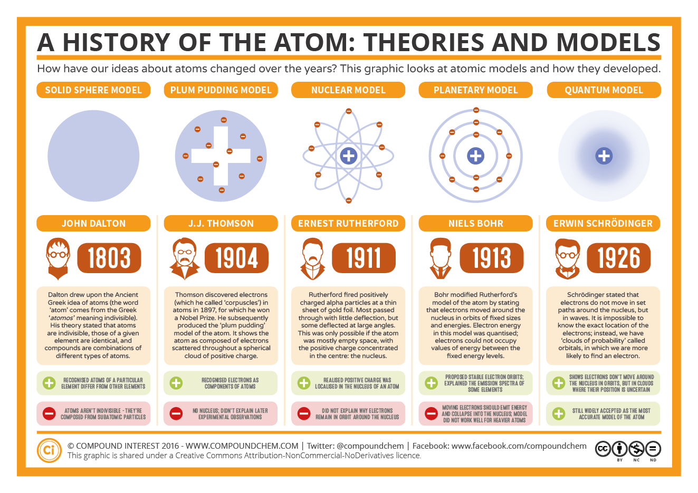

# Becoming a better programmer

## What to learn next?

> "Skate to where the puck is going, not where it has been." -- Steve Jobs

So we've come to the end of our 16-week journey. You've learned a lot, but there's still a vast ocean of things to learn out there. It can be quite daunting when deciding what to learn next. There's really so much out there, so how can you make a good decision?

### Wisdom of the crowd

Looking at [Stack Overflow Developer Survey](https://insights.stackoverflow.com/survey/2020#technology), we can see that JavaScript, Node.js, Express, and MongoDB are among the most popular technologies today. That's why we chose them when we developed our curriculum.

You can also see that there are other interesting insights to be gained from the survey. TypeScript has been steadily gaining popularity, along with Python and Rust. React Native and PostgreSQL are among the most popular frameworks and databases respectively. Stack Overflow releases these surveys each year, so don't forget to look at those results as and when they come out.

Another useful reference is the [ThoughtWorks Radar](https://www.thoughtworks.com/radar). These are broken into four areas - Techniques, Tools, Platforms, as well as Languages and Frameworks. The radar is updated frequently, so be sure to check back for [updates](https://www.thoughtworks.com/radar#subscribe).

### Build stuff

There's nothing quite like putting ideas into action and building a project; especially [silly ones](https://firstround.com/review/Spotifys-Design-Lead-on-Why-Side-Projects-Should-be-Stupid/). However, we caution against blindly following tutorials to build a project. You should rely on reading documentation and figuring out how to build stuff from scratch.

## Having the right mindset

> “I'm not a great programmer; I'm just a good programmer with great habits.” -- Kent Beck

Often times the difference between a mediocre programmer and a good one boils down to their habits.

If you think about it, a lot of programming is about following good habits, which ultimately boils down to discipline.

Think about how you commit your code. While it's easier to run `git add .` or `git add --all`, a disciplined programmer would do the additional step of checking their work before committing by running `git add -p`. They would then add a meaningful message to their commits.

Think about TDD. While some programmers claim to follow TDD, most take shortcuts. A disciplined programmer, however, would do [TDD like they meant it](https://cumulative-hypotheses.org/2011/08/30/tdd-as-if-you-meant-it/).

## Thinking from first principles

> "I think it is important to reason from first principles rather than by analogy. The normal way we conduct our lives is we reason by analogy." -- Elon Musk

While it can be easier and useful to reason from analogy, to learn things at a deeper level we want to reason from first principles instead.

First principles thinking is like going down the rabbit hole, but how far down do we really want to go? Though thinking from first principles is useful, we would still typically rely more on analogies to navigate the world around us. In fact, we just used an analogy to help explain thinking from first principles.

## Developing good mental models

When trying to learn about atoms, we are presented with models. These models do not accurately represent how atoms really look like in real life, but they help us mentally visualize them in order for us to grasp their behavior and concepts.

Similarly, we use models to understand and navigate around our digital world. Having good mental models that more accurately represent how things work in the real world will mean a deeper understanding of their behavior and how to debug code when things go wrong.

## Being part of the wider developer community

You're a developer now, so leverage on the wider developer community. They can be found on Meetup and on Facebook.

Go for talks at various meetups to learn about new technologies and meet new people. Give talks at these meet ups to share your knowledge back to the community.

### Junior Developers Singapore

[Junior Developers Singapore](https://juniordev.sg/) is the Singapore chapter of the global [Junior Developer](http://juniordev.io/) community. They are on [Meetup](https://www.meetup.com/Junior-Developers-Singapore/), [Twitter](https://twitter.com/juniordevsg), and [Facebook](https://www.facebook.com/groups/juniorDevSG/).

Junior Developers Singapore also has a [mentoring program](https://github.com/JuniorDevSingapore/mentoring-program).

Join them on [Telegram](https://t.me/joinchat/AMjNsFh9UGIR5VvOs1_nXA) and [Slack](http://juniordevcommunity.herokuapp.com/).

### SingaporeJS

SingaporeJS is a community for all things related to JavaScript and modern web technologies.

They are on [Meetup](http://www.meetup.com/Singapore-JS/) and on [GitHub](https://github.com/SingaporeJS/talk.js).

### Kopi.js

From the creators of [Kopi Guide](https://kopi.guide/). [Kopi.js](https://kopijs.org/) is a casual community for you to meet people over brunch at different cafes in Singapore. It's a great way to meet new people and learn what their day to day work is like as developers.

Join them on [Slack](https://launchpass.com/kopijs).

Other related groups are [Geek Brunch](https://geekbrunch.sg/) and [Geek Path](https://thegeekpath.com/).

### Engineers.sg

[Engineers.sg](https://engineers.sg/) is a community of volunteers who record videos of various talks and put them up on YouTube. You can sign up as a volunteer.

## Attending developer conferences

Go to conferences. Some conferences may be expensive, but you can volunteer with [Engineers.sg](https://engineers.sg/) to record these videos and attend these conferences for free.

You can also watch videos of past [developer conferences](https://engineers.sg/conferences).

Some noteworthy conferences in Singapore include, FOSSASIA Summit, GeekCampSG, YOW! Singapore, PyConSG, GopherConSG, and iOSConfSG.
